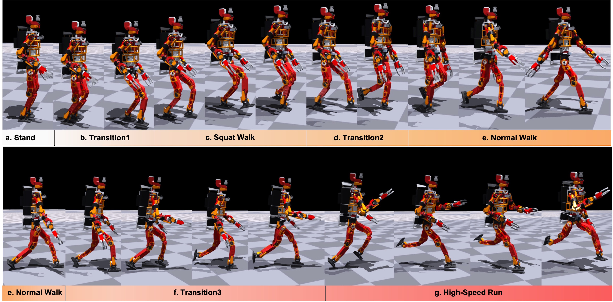

I'm currently a Ph.D. student under the supervision of Prof. [Kei Okada](http://www.jsk.t.u-tokyo.ac.jp/~k-okada/index-e.html) 
and [Kunio Kojima](https://scholar.google.com/citations?user=9W17PD0AAAAJ&hl=ja) at [JSK Lab](http://www.jsk.t.u-tokyo.ac.jp/), 
The University of Tokyo. Prior to this, I completed my master’s degree at the University of Tokyo and obtained my bachelor’s degree from [Tongji University](https://en.tongji.edu.cn/p/#/), China. 
Additionally, I have one year of research experience as a student researcher at [Tencent Robotics-X](https://roboticsx.tencent.com/#/).

My research interests lie at the intersection of Robotics, Machine Learning, and Control Theory, with a particular focus on utilizing reinforcement learning to empower humanoid robots to autonomously acquire diverse whole-body motion skills.

## News

- **2024.06**: One paper about developing magnetic sensor for humanoid contact force estimation is accepted by [IROS 2024](https://iros2024-abudhabi.org/). Congratulations, Takuma!
- **2024.05**: Honored to be an invited speaker in [ICRA2024 Workshop on Humanoid Whole-body Control](https://icra-2024-humanoid.github.io/). Thanks for organizers, and learned a lot from other excellent speakers!
- **2024.01**: [HumanMimic](https://www.youtube.com/watch?v=sdM11yHpzi8) is accepted by [ICRA 2024](https://2024.aclweb.org/). Thanks all co-authors. See you in Yokohama!
- **2023.10**: Honored to share an invited talk with [Prof. Fan Shi](https://fanshi14.github.io/me/) in [IROS2023 Workshop on Reactive and Predictive
Humanoid Whole-body Control](https://iros-2023-humanoid.github.io/). Appreciate the organizers and Prof. Shi for providing such a valuable opportunity, an excellent experience!
- **2023.09**: Present about learning straight-leg walking for humanoid robots at [RSJ2023](https://ac.rsj-web.org/2023/) in Sendai.
- **2023.06**: One paper about humanoid whole-body torque control with joint friction compensation is accepted by [IROS 2023](https://ieee-iros.org/).
- **2021.06**: One paper about hybrid RL+WBC for quadrupedal locomotion is accepted by [IROS 2021](https://2024.aclweb.org/) during the internship at Tencent Robotics-X.(Co-first author)

## Publications

### First author:

**[ICRA 2024] HumanMimic**
<html>
    <table style="margin-left: auto; margin-right: auto; border-collapse: collapse; border: none; width: 100%;">
        <tr>
            <td style="width: 50%; border: none;">
                <!-- Left side content -->
                
            </td>
            <td style="width: 50%; border: none;">
                <!-- Right side content -->
                <a href="https://arxiv.org/pdf/2406.10811">LLMFactor: Extracting Profitable Factors through Prompts for Explainable Stock Movement Prediction</a>
                <ul>
                    <li>In this study, we introduce a novel framework called LLMFactor, which employs Sequential Knowledge-Guided Prompting (SKGP) to identify factors that influence stock movements using LLMs.</li>
                    <li><strong>Meiyun Wang</strong>, Kiyoshi Izumi, Hiroki Sakaji, LLMFactor: Extracting Profitable Factors through Prompts for Explainable Stock Movement Prediction, <em>Findings of the Association for Computational Linguistics: ACL</em>, 2024.</li>
                </ul>
            </td>
        </tr>
    </table>
</html>

**[IROS 2021] Run like a dog**
<html>
    <table style="margin-left: auto; margin-right: auto; border-collapse: collapse; border: none; width: 100%;">
        <tr>
            <td style="width: 50%; border: none;">
                <!-- Left side content -->
                
            </td>
            <td style="width: 50%; border: none;">
                <!-- Right side content -->
              <a style="text-decoration: none;">CausalEnhance: Knowledge-Enhanced Pre-training for Causality Identification and Extraction</a>
                <ul>
                    <li>We introduce CausalEnhance, a novel knowledge-enhanced pre-training method empowered by a rule-based automated annotation system.</li>
                  <li><strong>Meiyun Wang</strong>, Kiyoshi Izumi, Hiroki Sakaji.</li>
                </ul>
            </td>
        </tr>
    </table>
</html>

### Co-authored:
**[IROS 2024] PatentCausality**
<html>
    <table style="margin-left: auto; margin-right: auto; border-collapse: collapse; border: none; width: 100%;">
        <tr>
            <td style="width: 50%; border: none;">
                <!-- Left side content -->
                
            </td>
            <td style="width: 50%; border: none;">
                <!-- Right side content -->
                <a href="https://www.sciencedirect.com/science/article/pii/S0172219023000686" style="text-decoration: none;">Discovering new applications: Cross-domain exploration of patent documents using causal extraction and similarity analysis</a>
                
                <ul>
                    <li>This study suggests an approach employing causality extraction and similarity analysis to explore a technology's applicability beyond what is explicitly stated in patents.</li>
                    <li><strong>Meiyun Wang</strong>, Hiroki Sakaji, Hiroaki Higashitani, Mitsuhiro Iwadare, and Kiyoshi Izumi, <em>World Patent Information</em>, 75:102238, 2023.</li>
                </ul>
            </td>
        </tr>
    </table>
</html>

**[IROS 2023] PatentCausality**
<html>
    <table style="margin-left: auto; margin-right: auto; border-collapse: collapse; border: none; width: 100%;">
        <tr>
            <td style="width: 50%; border: none;">
                <!-- Left side content -->
                
            </td>
            <td style="width: 50%; border: none;">
                <!-- Right side content -->
                <a href="https://www.sciencedirect.com/science/article/pii/S0172219023000686" style="text-decoration: none;">Discovering new applications: Cross-domain exploration of patent documents using causal extraction and similarity analysis</a>
                
                <ul>
                    <li>This study suggests an approach employing causality extraction and similarity analysis to explore a technology's applicability beyond what is explicitly stated in patents.</li>
                    <li><strong>Meiyun Wang</strong>, Hiroki Sakaji, Hiroaki Higashitani, Mitsuhiro Iwadare, and Kiyoshi Izumi, <em>World Patent Information</em>, 75:102238, 2023.</li>
                </ul>
            </td>
        </tr>
    </table>
</html>

### Japanese Conferences:
<ul>
<li><strong>[JSAI 2023]</strong>: <a style="text-decoration: none;">New Intellectual Property Management Method Aiming at Expanding Technology Applications and Secondary Development</a>, <strong>Meiyun Wang</strong>, et al, <em>The 37th Annual Conference of the Japanese Society for Artificial Intelligence</em>, 2023.
  </li>
  
  <li>
    <strong>[ICAIF 2022]</strong>: <a style="text-decoration: none;">A New Approach to Assessing Corporate R&D Capabilities: Exploring Patent Value Based on Machine Learning</a>, <strong>Meiyun Wang</strong>, et al, <em>3rd Workshop on Women in AI and Finance, 3rd ACM International Conference on AI in Finance</em>, New York, USA, Nov 2nd, 2022.
  </li>
</ul>

### Co-authored:

## 🎖 Honors

- **2024 ~ 2025**: <a href="https://www.cis-trans.jp/spring_gx/index-e.html">Fostering Advanced Human Resources to Lead Green Transformation (SPRING GX)</a>, The University of Tokyo.
- **2023 ~ 2025**: <a href="https://gsdm.u-tokyo.ac.jp/gsdm2.0/en/wings-gsdm/">World-leading Innovative Graduate Study Program on Global Leadership for Social Design and Management (WINGS-GSDM)</a>, The University of Tokyo.
- **2023 ~ 2025**: Data Science Practicum, The University of Tokyo.
- **2023 ~ 2025**: Designing Future Society Fellowship, The University of Tokyo.

## 📖 Educations

- **2022.09 - 2025.09**: PhD, The University of Tokyo, Japan.
- **2020.04 - 2022.09**: Master, The University of Tokyo, Japan.

## 💻 Internships

- **2023.11 - 2024.01**: Mizuho, Tokyo.
- **2022.04 - 2022.07**: Google STEP, Tokyo.
- **2020.11 - 2021.08**: Tencent, Shenzhen.
- **2020.08 - 2020.11**: PingAn, Shenzhen.