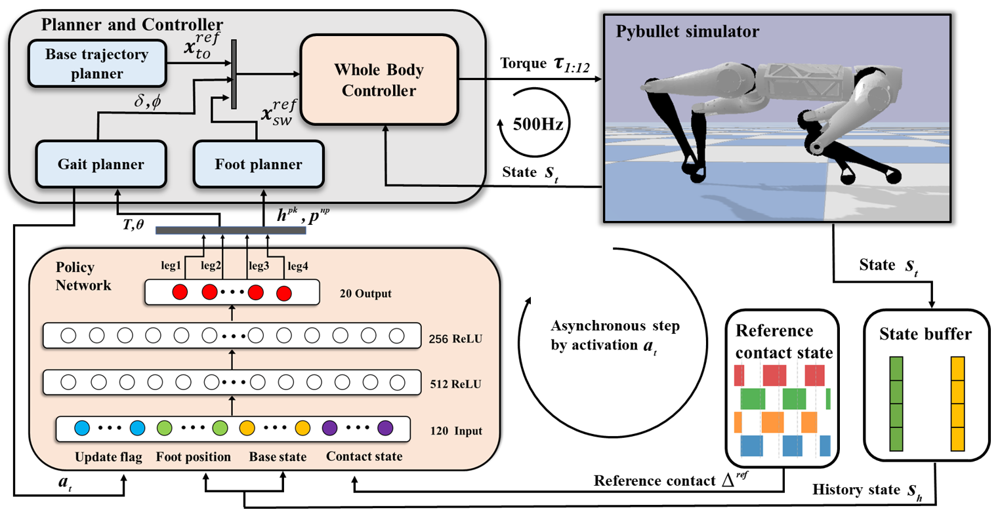

I'm currently a Ph.D. student under the supervision of Prof. [Kei Okada](http://www.jsk.t.u-tokyo.ac.jp/~k-okada/index-e.html) 
and [Kunio Kojima](https://scholar.google.com/citations?user=9W17PD0AAAAJ&hl=ja) at [JSK Lab](http://www.jsk.t.u-tokyo.ac.jp/), 
The University of Tokyo. Prior to this, I completed my master’s degree at the University of Tokyo and obtained my bachelor’s degree from [Tongji University](https://en.tongji.edu.cn/p/#/), China. 
Additionally, I have one year of research experience as a student researcher at [Tencent Robotics-X](https://roboticsx.tencent.com/#/).

My research interests lie at the intersection of Robotics, Machine Learning, and Control Theory, with a particular focus on utilizing reinforcement learning to empower humanoid robots to autonomously acquire diverse whole-body motion skills.

## News

- **2024.06**: A paper on developing the magnetic sensor for humanoid whole-body contact force estimation has been accepted by [IROS 2024](https://iros2024-abudhabi.org/). Congratulations, Takuma!
- **2024.05**: Honored to be an invited speaker at [ICRA2024 Workshop on Humanoid Whole-body Control](https://icra-2024-humanoid.github.io/). Thanks to the organizers, and I learned a lot from the other excellent speakers!
- **2024.01**: Our paper, [HumanMimic](https://www.youtube.com/watch?v=sdM11yHpzi8), has been accepted by [ICRA 2024](https://2024.aclweb.org/). Thanks to all co-authors. See you in Yokohama!
- **2023.10**: Honored to share an invited talk with [Dr. Fan Shi](https://fanshi14.github.io/me/) at the [IROS2023 Workshop on Reactive and Predictive
Humanoid Whole-body Control](https://iros-2023-humanoid.github.io/). I appreciate the organizers and Dr. Shi for providing such a valuable opportunity. It was an excellent experience!
- **2023.09**: Presented on learning straight-leg walking for humanoid robots at [RSJ2023](https://ac.rsj-web.org/2023/) in Sendai.
- **2023.06**: A paper on humanoid whole-body torque control with joint friction compensation has been accepted by [IROS 2023](https://ieee-iros.org/).
- **2021.06**: A paper on hybrid RL+WBC for quadrupedal locomotion was accepted by [IROS 2021](https://2024.aclweb.org/) during my internship at Tencent Robotics-X. (Co-first author)

## Publications

### First author:

**[ICRA 2024] HumanMimic**
<html>
    <table style="margin-left: auto; margin-right: auto; border-collapse: collapse; border: none; width: 100%;">
        <tr>
            <td style="width: 50%; border: none;">
                <!-- Left side content -->
                
            </td>
            <td style="width: 50%; border: none;">
                <!-- Right side content -->
                HumanMimic: Learning Natural Locomotion and Transitions for Humanoid Robot via Wasserstein Adversarial Imitation
                
<strong>Annan Tang</strong>, Takuma Hiraoka, Naoki Hiraoka, Fan Shi, Kento Kawaharazuka, Kunio Kojima, Kei Okada, and Masayuki Inaba. 

                
In this study, we introduce a soft-boundary-constrained Wasserstein adversarial imitation learning system, allowing humanoid robots to replicate natural whole-body locomotion patterns and execute seamless transitions by mimicking human motions. Our system is evaluated on a full-sized humanoid JAXON. 
                     The resulting single control policy demonstrates a wide range of locomotion patterns, including standing, push-recovery, squat walking, human-like straight-leg walking, and dynamic running.

                

                    <a href="https://www.youtube.com/watch?v=sdM11yHpzi8" style="text-decoration: none;">[Video]</a>
                    <a href="https://arxiv.org/abs/2309.14225" style="text-decoration: none;">[Paper]</a>
                

            </td>
        </tr>
    </table>
</html>

**[IROS 2021] Run like a dog**
<html>
    <table style="margin-left: auto; margin-right: auto; border-collapse: collapse; border: none; width: 100%;">
        <tr>
            <td style="width: 50%; border: none;">
                <!-- Left side content -->
                
            </td>
            <td style="width: 50%; border: none;">
                <!-- Right side content -->
                Run Like a Dog: Learning Based Whole-Body Control Framework for Quadruped Gait Style Transfer
                
Fulong Yin*, <strong>Annan Tang*</strong>, Liangwei Xu, Yue Cao, Yu Zheng, Zhengyou Zhang, Xiangyu Chen, *(co-first authors)

                
In this paper, a learning-based whole-body locomotion controller is proposed, which enables quadruped robots to perform running in the style of real animals. We use a low-level controller based on multi-rigid body dynamics to calculate desired torques for each joint, while the high-level neural network policy plans the expected gait and foothold.

                

                    <a href="https://www.youtube.com/watch?v=g_0dtaTxG2M" style="text-decoration: none;">[Video]</a>
                    <a href="https://ieeexplore.ieee.org/stamp/stamp.jsp?tp=&arnumber=9636805&tag=1" style="text-decoration: none;">[Paper]</a>
                

            </td>
        </tr>
    </table>
</html>

### Co-authored:
**[IROS 2024] Magnetic tactile sensor for humanoid**
<html>
    <table style="margin-left: auto; margin-right: auto; border-collapse: collapse; border: none; width: 100%;">
        <tr>
            <td style="width: 50%; border: none;">
                <!-- Left side content -->
                
            </td>
            <td style="width: 50%; border: none;">
                <!-- Right side content -->
                Magnetic tactile sensor with load tolerance and flexibility using frame structures for estimating triaxial contact force distribution of humanoid
                
Takuma Hiraoka, Ren Kunita, Kunio Kojima, Naoki Hiraoka, Masanori Konishi, Tasuku Makabe, <strong>Annan Tang</strong>, Kei Okada and Masayuki Inaba

                
This paper proposes a method for constructing a load-tolerant tactile sensor that separates the loaded and measuring parts using magnetism and protects the measuring components within the robot's frame. It also explores modeling the relationship between physical deformations and contact force distribution.

                

                    <a href="https://annan-tang.github.io/" style="text-decoration: none;">[Video(coming soon)]</a>
                    <a href="https://annan-tang.github.io/" style="text-decoration: none;">[Paper(coming soon)]</a>
                

            </td>
        </tr>
    </table>
</html>

**[IROS 2023] Humanoid Whole-Body Torque Control**
<html>
    <table style="margin-left: auto; margin-right: auto; border-collapse: collapse; border: none; width: 100%;">
        <tr>
            <td style="width: 50%; border: none;">
                <!-- Left side content -->
                
            </td>
            <td style="width: 50%; border: none;">
                <!-- Right side content -->
                Whole-Body Torque Control Without Joint Position Control Using Vibration-Suppressed Friction Compensation for Bipedal Locomotion of Gear-Driven Torque Sensorless Humanoid
                
Takuma Hiraoka, Shimpei Sato, Naoki Hiraoka, <strong>Annan Tang</strong>, Kunio Kojima, Kei Okada, Masayuki Inaba, Koji Kawasaki. 

                
In this paper, we propose a four-layer hierarchical torque control method for humanoid whole-body movements, including friction compensation, acceleration control, gravity control, and landing adjustment.

                

                    <a href="https://ieeexplore.ieee.org/abstract/document/10341698/media#media" style="text-decoration: none;">[Video]</a>
                    <a href="https://ieeexplore.ieee.org/abstract/document/10341698" style="text-decoration: none;">[Paper]</a>
                

            </td>
        </tr>
    </table>
</html>
### Others:
<ul>

<li><strong>[RSJ 2023]</strong>: <a style="text-decoration: none;">Learning Straight-Leg Walking Skill for Humanoid Robots Through Imitating Human Demonstrations</a>, <strong>Annan Tang</strong>, et al. <em> The 41st annual conference of the Robotics Society of Japan (RSJ2023)</em>.
  </li>
  
  <li>
    <strong>[SI 2023]</strong>: <a style="text-decoration: none;">Analysis of motor synergy focusing on energy efficiency in whole-body motion of life-size humanoid</a>, Yuda Issei, <strong>Annan Tang</strong>, et al.<em> In Proceedings of the 24th SICE System Integration Division Annual Conference</em>.
  </li>
</ul>

## Invited Talks

<ul>
<li>
  <strong>[ICRA2024 Workshop]</strong>: 
  Towards Versatile Whole-Body Motion Behavior for Humanoid Robot: From Model-Based Control to Reinforcement Learning, 
  <strong>Annan Tang</strong>. 
  <a href="https://icra-2024-humanoid.github.io/" style="text-decoration: none;">ICRA2024 Workshop on Humanoid Whole-body Control</a>, Yokohama, Japan, 2024.
</li>

<li>
  <strong>[IROS2023 Workshop]</strong>: 
  Reference-based vs Reference-free Reinforcement Learning for Humanoid Robot, Fan Shi, <strong>Annan Tang</strong>. 
  <a href="https://iros-2023-humanoid.github.io/" style="text-decoration: none;">IROS2023 Workshop on Reactive and Predictive Humanoid Whole-body Control</a> (online), Detroit, USA, 2023.
</li>

</ul>

## Educations

🎓 PhD(-ing) in Mechano-Informatics  
   University of Tokyo

🎓 MSc in Mechano-Informatics  
   University of Tokyo

🎓 BSc in Mechatronics Engineering  
   Tongji University

## 💻 Internships

- **2020.08 - 2021.08**: Tencent Robotics-X, Shenzhen.

## Personal Projects

**PMSM FOC Control**
<html>
    <table style="margin-left: auto; margin-right: auto; border-collapse: collapse; border: none; width: 100%;">
        <tr>
            <td style="width: 50%; border: none;">
                <!-- Left side content -->
                
            </td>
            <td style="width: 50%; border: none;">
                <!-- Right side content -->
                <a style="text-decoration: none;">Developing and Deploying Field-Oriented Control on Planetary Gear-Based Permanent Magnet Synchronous Motor Systems</a>
                
<strong>Annan Tang</strong>

            </td>
        </tr>
    </table>
</html>

